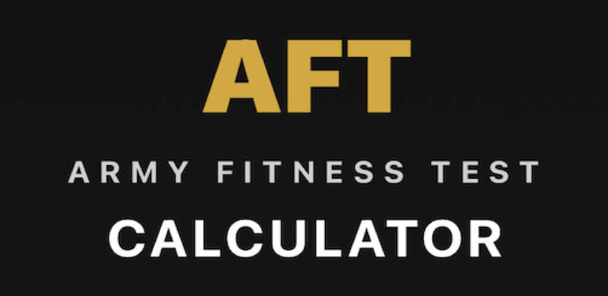

# AFT Calc - Army Fitness Test Calculator

A mobile app for calculating Army Fitness Test (AFT) scores with official scoring tables. Available for Android and iOS.



## Features

- **Live Scoring** - Scores update instantly as you enter your results
- **All 5 AFT Events** - Deadlift, Hand-Release Push-Ups, Sprint-Drag-Carry, Plank, 2-Mile Run
- **Alternate Aerobic Events** - Support for alternate cardio options
- **MOS-Based Standards** - Combat vs Combat-Enabling MOS scoring rules
- **Age & Gender Adjusted** - Accurate scoring across all demographics
- **Medical Profile Support** - Toggle exemptions for individual events
- **DA Form 705 Generation** - Auto-fill the official Army fitness scorecard
- **Pass/Fail Indicators** - Color-coded feedback (red/yellow/green)
- **Dark Theme** - GoArmy-inspired military aesthetic

## AFT Events & Scoring

| Event | Range | Points |
|-------|-------|--------|
| 3-Rep Max Deadlift | 140-340 lbs | 0-100 |
| Hand-Release Push-Up | 10-60+ reps | 0-100 |
| Sprint-Drag-Carry | 1:33-3:00+ | 0-100 |
| Plank | 1:30-4:00+ | 0-100 |
| 2-Mile Run | 13:30-21:00+ | 0-100 |

### Passing Standards

| MOS Category | Min Per Event | Min Total |
|--------------|---------------|-----------|
| Combat | 60 points | 350 points |
| Combat-Enabling | 60 points | 300 points |

### Age Brackets
17-21, 22-26, 27-31, 32-36, 37-41, 42-46, 47-51, 52-56, 57-61, 62+

## Download

- **iOS**: [App Store](https://apps.apple.com/app/aft-calc) *(Coming Soon)*
- **Android**: [Google Play](https://play.google.com/store/apps/details?id=com.aftcalculator.android) *(Coming Soon)*

## Beta Testing

Want to help test the app before release?

- **iOS TestFlight**: Contact for invite
- **Android Closed Testing**: [Join Beta](https://play.google.com/apps/testing/com.aftcalculator.android)

## Tech Stack

### Android
- Kotlin
- Jetpack Compose (Material 3)
- MVVM Architecture
- PDFBox-Android for Form 705 generation

### iOS
- Swift
- SwiftUI
- PDFKit for Form 705 generation

### Shared
- Kotlin Multiplatform (KMP) for scoring logic
- GitHub Actions CI/CD
- Fastlane (iOS deployment)

## Building from Source

### Prerequisites
- Android Studio (for Android)
- Xcode 15+ (for iOS)
- JDK 21

### Android
```bash
# Debug build
./gradlew :androidApp:assembleDebug

# Install on device
./gradlew :androidApp:installDebug
```

### iOS
```bash
# Open in Xcode
open iosApp/iosApp.xcodeproj

# Or build from command line
cd iosApp
xcodebuild -project iosApp.xcodeproj -scheme iosApp -configuration Debug build
```

## Project Structure

```
aft-app/
├── shared/              # Kotlin Multiplatform shared scoring logic
├── androidApp/          # Android app (Jetpack Compose)
├── iosApp/              # iOS app (SwiftUI)
├── AppIcons/            # App icons and store assets
├── docs/                # Official AFT documentation
└── .github/workflows/   # CI/CD pipelines
```

## Contributing

Contributions welcome! Please:

1. Fork the repository
2. Create a feature branch (`git checkout -b feature/amazing-feature`)
3. Commit your changes (`git commit -m 'Add amazing feature'`)
4. Push to the branch (`git push origin feature/amazing-feature`)
5. Open a Pull Request

## Roadmap

- [x] Core scoring calculator
- [x] All 5 AFT events
- [x] MOS-based scoring rules
- [x] DA Form 705 PDF generation
- [x] iOS app
- [x] Android app
- [x] CI/CD pipelines
- [ ] Score history & persistence
- [ ] Training recommendations
- [ ] Progress tracking over time

## Official Sources

- [Army Fitness Test Official Site](https://www.army.mil/aft/)
- [HQDA EXORD 218-25 Scoring Tables](docs/)

## License

This project is for educational and personal use. AFT scoring tables are based on official U.S. Army standards.

## Disclaimer

This app is not affiliated with or endorsed by the U.S. Army. Always verify scores with official sources before use in an official capacity.

---

Built with pride for the men and women who serve.
